# SportsWorld: a live probabilistic world model of entire sporting seasons


**SportsWorld does not predict a game. It keeps one calibrated, continuously updating belief about a whole
competition** (every team and every game of the NFL, college football, NBA, NHL, college basketball, college
hockey and Formula 1) and shows how each new piece of evidence (a final score, a live drive, an injury report)
moves the next game, the rest of the schedule, the playoff race and the title.

Built at **MHacks 2026** · Season Intelligence Engine · real data only · **Live: [worldofsports.tech](https://worldofsports.tech)**

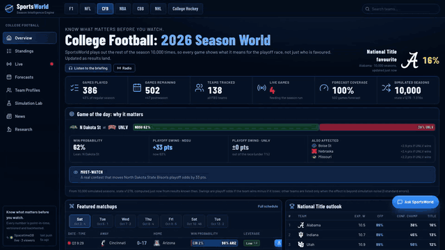

▶ Full-quality walkthrough: [`docs/media/sportsworld-walkthrough.mp4`](docs/media/sportsworld-walkthrough.mp4) ·
Research write-up: [`docs/research_report.md`](docs/research_report.md)

---

## Contents
1. [What it does](#what-it-does) · 2. [Feature tour](#feature-tour) · 3. [How it works](#how-it-works) ·
4. [Input space](#input-space) · 5. [Models and training](#models-and-training) · 6. [Why it works: evidence](#why-it-works-evidence) ·
7. [Agents, chat and voice](#agents-chat-and-voice) · 8. [Sponsor technology](#sponsor-technology) · 9. [Run it](#run-it) ·
10. [Repository map](#repository-map) · 11. [Honest limits](#honest-limits)

---

## What it does

| | |
|---|---|
| **Persistent world state** | Every team carries a latent strength *with uncertainty* (Kalman filter), updated after every result; F1 keeps separate driver and car states. |
| **Every game, forecast** | A calibrated model scores every remaining game (552 in college football right now) before and during play. |
| **Whole seasons, simulated** | 10,000 full seasons per league through versioned rules: NFL 7-team bracket, NBA play-in, NHL wildcard, FBS conference title games + 12-team CFP, NCAA tournament, F1 sprint + race points with FIA count-back. |
| **Propagation** | A final, a live score, or an injury report updates the team's state → every affected future game → the whole season → playoff and title odds, each step versioned and shown in a live feed. |
| **Counterfactuals** | "What if Michigan's QB misses 3 games?" / "What if Michigan beats Ohio State?" run on a private branch with common random numbers, so every difference is the scenario's effect. Canonical state is never touched. |
| **Live views** | Real ball position and drives (football), shot charts (basketball), shot / goal / hit maps (hockey), and every F1 car at its real track position. |
| **Agent + chat + voice** | A Fetch.ai agent on ASI:One, the same analyst as an on-site chat, live play-by-play commentary and spoken briefings (ElevenLabs). |
| **Research layer** | Seven replayed seasons, walk-forward evaluation, model bake-offs with game-clustered confidence intervals, a market benchmark, shown in the product, not hidden in a notebook. |

---

## Feature tour

Every screenshot is the live site; numbered callouts mark the real elements.

### 1. League "Season World"
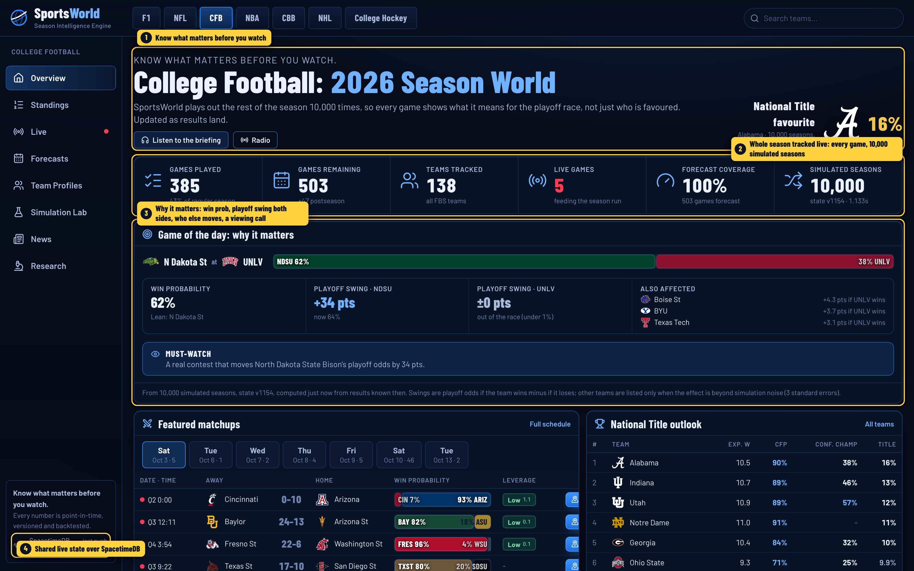

1. **Know what matters before you watch**: the season played out 10,000 times, so every game shows what it means for the race. Listen / Radio speak the briefing and every big swing (ElevenLabs).
2. **The whole season, live**: games played and remaining, teams tracked, live games conditioning the season run, forecast coverage, simulated seasons.
3. **Game of the day: why it matters**: win probability with an honest label (toss-up, lean, clear favourite, one-sided), each side's playoff swing (odds if it wins minus if it loses), other teams whose odds move beyond 3 Monte Carlo standard errors and who they should root for, and a viewing call (must-watch, upset watch, skip). The same card sits on every game page.
4. **SpacetimeDB live**: every viewer subscribes to one shared world state; score and probability changes slide in as "Pushed by SpacetimeDB · state vN" notices in every open browser at once (two clients measured 4 ms apart).

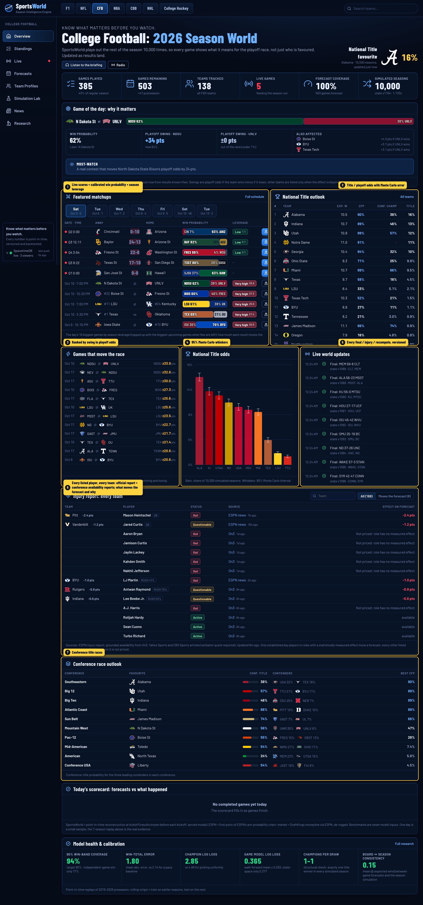

1. **Featured matchups**: live score and clock, calibrated win probability in official team colours, and **season leverage**.
2. **Title outlook**: title / playoff / conference odds from 10,000 seasons.
3. **Games that move the race**: the next 15 days ranked by playoff-odds swing.
4. **Title odds** with 95 % Monte Carlo whiskers.
5. **Live world updates**: every final, injury change and recompute, with the state version it produced.
6. **Injury report, every team**: the official ESPN report plus the conferences' mandated availability reports and injury news from other outlets (verbatim quote required), each player marked with whether it moves the forecast and why.
7. **Conference races**: favourite and contenders in every conference.

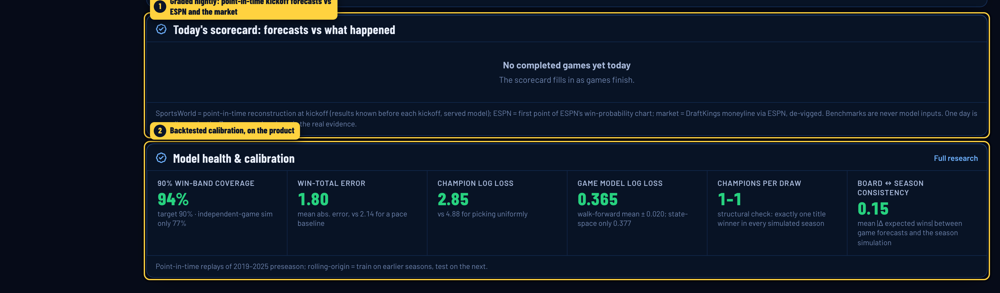

1. **Today's scorecard**: every finished game, graded from SportsWorld's point-in-time kickoff forecast next to ESPN's own model and the de-vigged market, with calibration buckets.
2. **Model health on the product**: 90 % win-band coverage (independent-game simulation far lower), win-total error vs a pace baseline, champion log loss, walk-forward game-model log loss, structural checks.

### 2. Team "Season World"
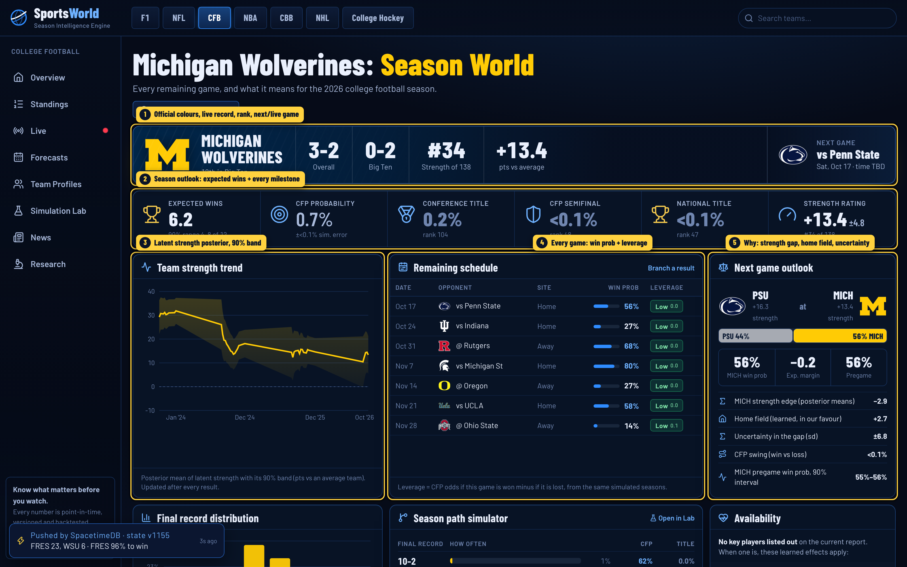

1. **Header band** in official colours: record, conference record, strength rank, and the next (or live) game.
2. **Season outlook**: expected wins with a 90 % range, every milestone probability with its rank.
3. **Team strength trend**: the latent-strength posterior and its 90 % band after every result.
4. **Remaining schedule**: win probability and leverage for every game.
5. **Next-game outlook**: strength gap, learned home field, uncertainty, playoff swing.

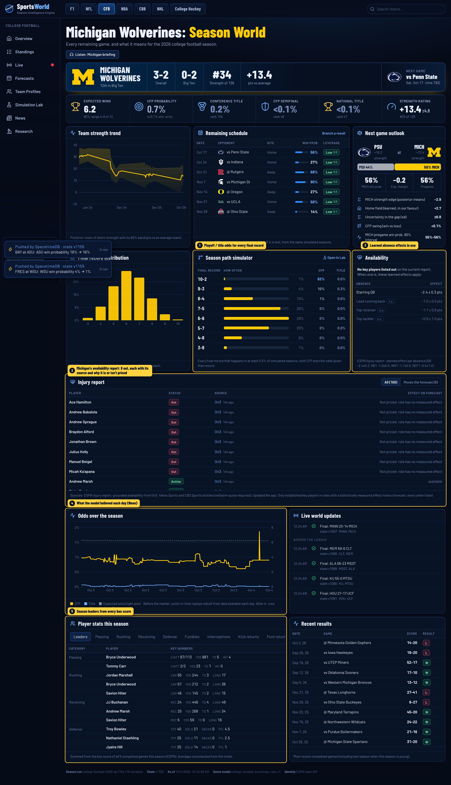

1. **Season path simulator**: playoff and title odds *conditional on each final record*.
2. **Availability**: the learned absence effects in use.
3. **Injury report**: this team's listed players (here Michigan's Big Ten availability report: 8 out), each with its source and why it is or isn't priced.
4. **Odds over the season**: what the model believed each day, from point-in-time replays and live-archived runs (Neon Postgres).
5. **Player stats**: season leaders and full category tables summed from every box score; live box scores on game pages.

### 3. Season Simulation Lab
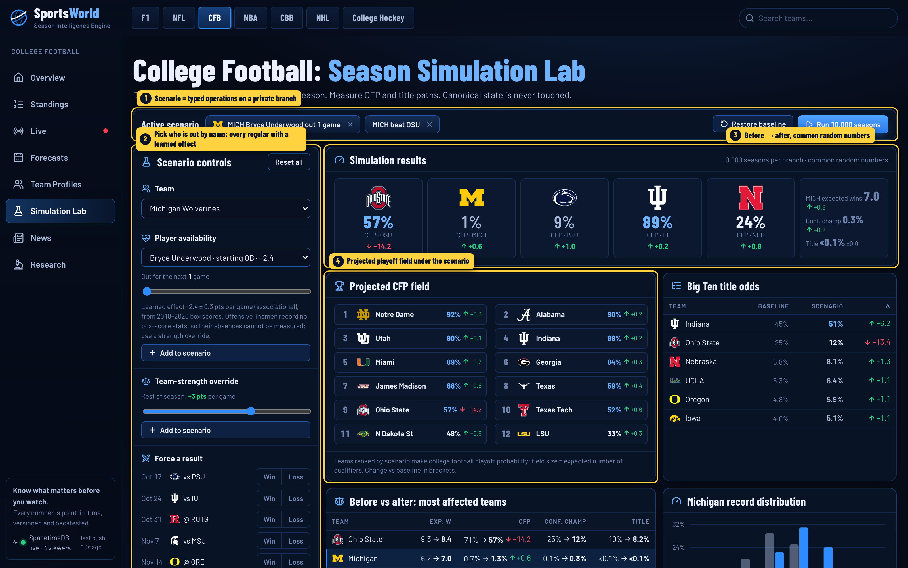

1. **Active scenario**: typed operations on a private branch (here: Michigan's starting QB out, and Michigan beats Ohio State).
2. **Controls**: pick who is out *by name* (every regular with their learned effect: the QB, and backs, receivers and defenders by their share of the team's carries, catches and tackles), strength overrides, forced results, or plain English. Before a run, one-click scenarios built from the team's schedule and players.
3. **Before → after**; both branches share random numbers, so every difference is the scenario.
4. **Projected playoff field** under the scenario, plus conference-title ripple effects.

### 4. Live game views with real positions
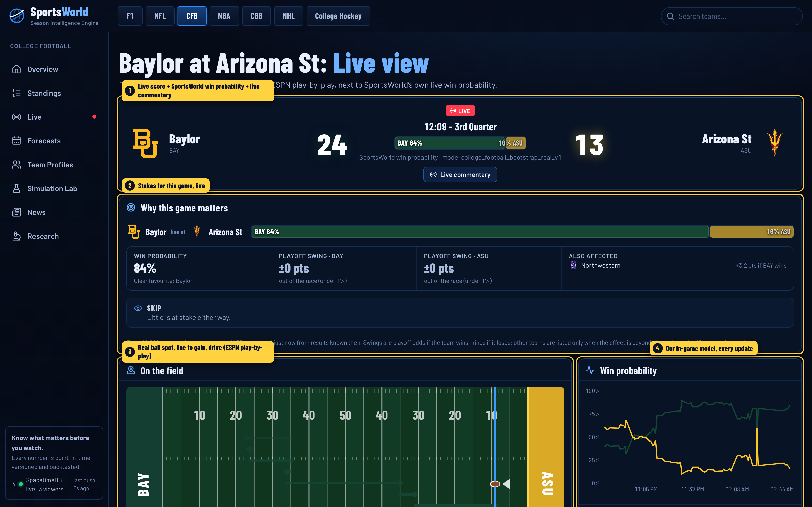

1. Live score, SportsWorld's win probability and **live commentary** (ElevenLabs voices every play from the real play text).
2. **Why this game matters**, live.
3. Real ball spot, line to gain and current drive from ESPN play-by-play.
4. SportsWorld's in-game win probability, every update.

| Basketball | Formula 1 |
|---|---|
| 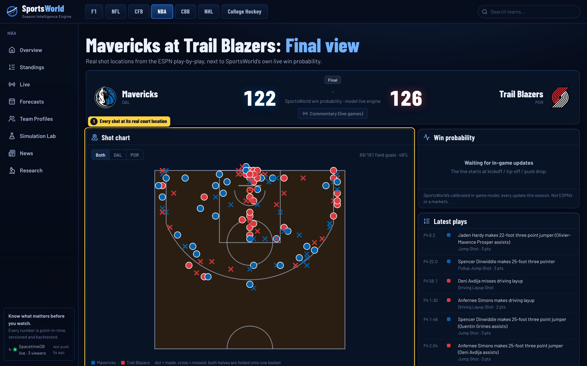 | 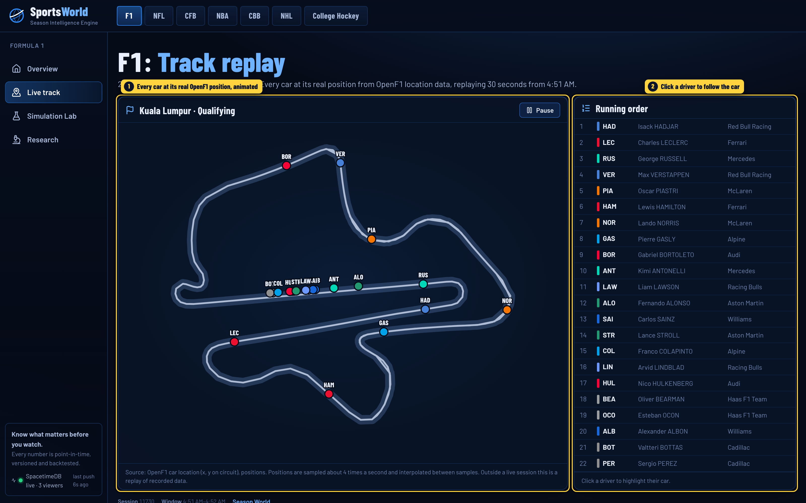 |
| Every shot at its real court location, made / missed, by team. | Every car at its real OpenF1 position on the circuit, animated; click a driver to follow the car. |

Hockey games show shot attempts, goals and hits at their real rink coordinates. Per-player tracking is proprietary
for football, basketball and hockey, so SportsWorld shows the real positions that are public (ball, shots, events,
cars) and labels exactly what each view is.

### 5. Ask SportsWorld
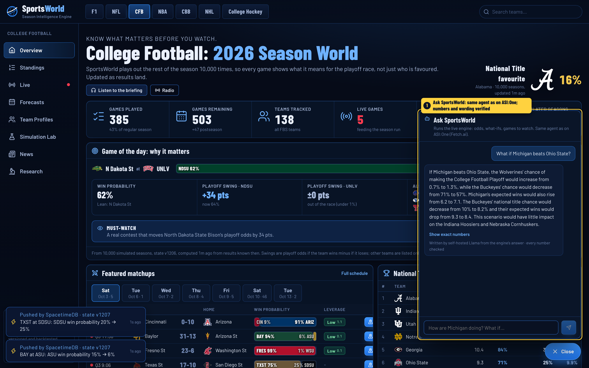

The same analyst that answers on ASI:One, inside the site. It turns a question into actions on the engine (here it
ran 10,000-season simulations for *"What if Michigan beats Ohio State?"*). A self-hosted Llama rewrites the answer
conversationally; the rewrite is rejected if any number, any "close game" claim or any verdict (favourite, upset,
competitive...) is not in the engine's answer. The exact numbers are one click away.

### 6. Research


1. **Rewind**: for every replayed season, the odds the model gave the eventual champion at preseason, a quarter, half and three quarters of the way through, each rebuilt from only what was known on that date, next to a random-pick baseline.
2. Historical season replay, rolling-origin evaluation, in-game model bake-offs, the market benchmark and learned player-availability effects, all reproducible from `scripts/`.

### 7. News and Team Profiles
| News | Team Profiles |
|---|---|
| 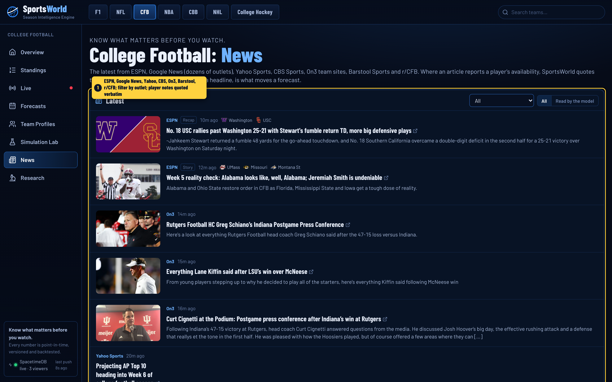 | 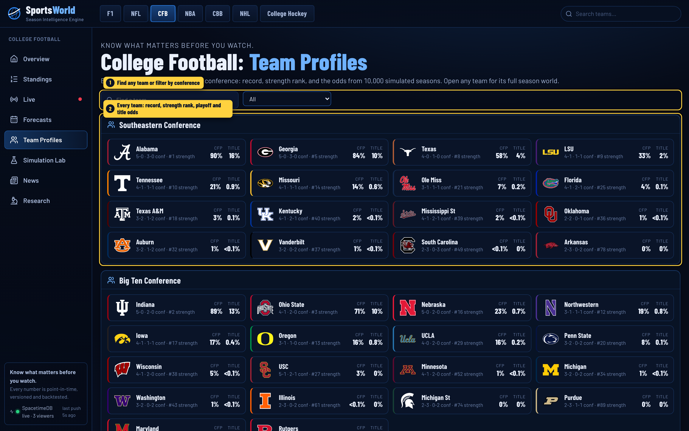 |
| ESPN, Google News (60+ outlets), Yahoo Sports, CBS Sports, On3 team sites, Barstool Sports and r/CFB, filterable by outlet; availability notes the model read are quoted verbatim. Reddit is shown, never used as evidence. | Every team by conference: record, strength rank, playoff and title odds; search and conference filter. |

---

## How it works

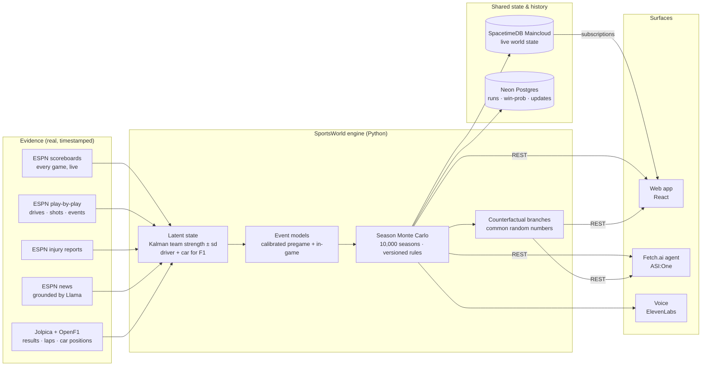

**Propagation, concretely.** A final score arrives → the result enters the rating book → both teams' latent
strength updates → every remaining game involving either team is re-scored → the season is re-simulated (10,000
draws, a new global state version) → SpacetimeDB pushes the new state to every open browser → Neon archives the
run → the feed and the radio say what changed. Live scores re-condition the season run on in-progress games
(rate-limited to once a minute); injury reports enter as learned strength deltas over an exact window.

**Point-in-time discipline.** Every observation carries its event time and the time the model knew it. Any
competition can be rebuilt exactly as it stood at any past instant (`SEASON_AS_OF=…`), which powers the offline
replay demo, the season backtests and the odds-over-the-season charts.

---

## Input space

What actually feeds the engine today (all public sources; nothing synthetic):

| Source | What | Volume archived | Used for |
|---|---|---|---|
| ESPN scoreboards | every game: teams, kickoff, venue, neutral site, live score / clock, status | **101,061 games**, 8 leagues (NFL / FBS / NBA / NHL from 2018; college basketball from 2022) | latent ratings, schedules, live state, season simulation |
| ESPN play-by-play | football drives and plays (down, distance, field position); basketball / hockey events with coordinates | **9,829** football games with every snap; NBA / NHL / NCAA event streams (NHL backfilled to 2018 for the bake-offs) | learned expected points, in-game models, live views, commentary |
| ESPN game summaries | participation (who played), box-score context | 8,343 games | learned player-absence effects |
| ESPN injury reports | current status of every listed player | live, every few minutes | availability deltas on future games |
| ESPN news | articles → grounded availability signals (verbatim span required) | live | evidence feed (display only, not a model input) |
| Jolpica | F1 results 2018 → today | all races | driver and car ratings, season state |
| OpenF1 | sessions, positions, car location (x, y) | live / recorded sessions | F1 live track |
| Market moneylines | de-vigged closing lines | 8,877 games | **benchmark only, never a feature** |
| ESPN team API | official colours, logos, standing summary | every team | identity only |

**Model features** (league features schema `league_features_v2_real`): home field, pregame latent-strength gap and
its uncertainty, form and rest, live score margin, time remaining, possession, down / distance / field position
→ learned expected points (football), period / power-play state (hockey). Out of scope by design: coaching,
scheme, recruiting, lineups, weather, betting prices (see [Honest limits](#honest-limits)).

---

## Models and training

| Component | Method | Trained on | Selected / validated by |
|---|---|---|---|
| **Latent team strength** | Kalman filter per league (mean + variance per team), season-to-season regression, newcomer prior; hyper-parameters (home field, observation noise, process noise, carry-over) fit by one-step predictive likelihood | every archived result, replayed in result-known order | predictive log likelihood on later games |
| **F1 state** | two-level Kalman: driver skill + car pace, reliability with decay | Jolpica results 2018 → | race-winner log loss on held-out races (0.917 vs 1.110 base rate) |
| **Event model (pregame + in-game)** | bootstrap-ensemble logistic on the features above, temperature-calibrated | whole games 60 % train / 20 % calibrate / 20 % test **by kickoff** | held-out log loss; per-league choice between learned model and the analytic Kalman model on the calibration window |
| **Expected points (football)** | learned from every snap, time-conditioned near the end of halves | football play-by-play | fixes late-game errors (ball at the opponent's 19, down 2, 0:38 → 29 % before vs 67 % after) |
| **Player absence** | residual of actual margin vs point-in-time Kalman expectation, regressed on established key-player absence | game summaries | t-statistics / standard errors (associational) |
| **Season simulation** | DYNAMIC: latent strength sampled once per simulated season (correlated futures) + drift; FAST: independent games at posterior means | the live state | 7 replayed seasons (below) |
| **Leverage** | P(milestone \| win) − P(milestone \| loss) from the FAST run | the live state | per-game swing in playoff odds |
| **Model bake-offs** | logistic vs LightGBM vs MLP vs GRU over the play sequence, multi-seed, walk-forward, on GPUs | play-by-play | game-clustered paired bootstrap CIs |
| **Language model** | self-hosted **Llama 3.3 70B** (vLLM) | n/a | only structures questions and news into schema-checked JSON and rewrites answers with every number verified; **never produces a probability** |

---

## Why it works: evidence

All numbers from chronological held-out windows or point-in-time historical replays (details:
[`docs/research_report.md`](docs/research_report.md)).

**1. Season odds are calibrated because futures are correlated.** Preseason 90 % final-wins interval coverage over
seven replayed seasons:

| League | DYNAMIC (SportsWorld) | FAST (independent games) |
|---|---:|---:|
| NFL | **0.94** | 0.77 |
| NBA | **0.91** | 0.52 |
| NHL | **0.95** | 0.74 |
| FBS | **0.94** | 0.77 |

Treating games as independent coin flips is badly overconfident; sampling the shared latent state once per
simulated season restores near-nominal coverage. It is the season-scale analogue of ignoring parameter uncertainty in a
portfolio simulation. Playoff-qualification log loss also improves at almost every checkpoint.

**2. The learned layer adds signal, consistently, where it should.** Walk-forward (train ≤ O−2, calibrate O−1,
test O) learned-model minus Kalman-only log loss by origin: NBA −0.016 · −0.016 · −0.018 · −0.015; FBS −0.011 ·
−0.006 · −0.017 · −0.013; NFL −0.058 · −0.007 · −0.009 · −0.029; hockey indistinguishable, so the per-league
model choice is made by data, not assumed.

**3. Capacity helps only with long, information-rich state and enough data.** A GRU over the NBA possession
sequence beats logistic in 11 of 12 walk-forward runs; in hockey neural models overfit one season of play-by-play
but win **24 of 24** walk-forward runs once it is backfilled to 2018. In football, logistic ≈ MLP ≈ GRU ≈ ESPN's own
published win probability (statistically tied with game-clustered CIs).

**4. Honest benchmark.** On true holdout games the de-vigged betting market beats SportsWorld pregame by ≈ 0.03 log
loss (≈ 0.01 in hockey). The market sees lineups, injury nuance and money flow that SportsWorld deliberately does
not consume; it is the yardstick for every new evidence source, never a feature.

**5. Absences are measurable where the data allows** (associational, 2018–2026 box scores): NFL starting QB −3.0 ±
0.5 pts, FBS starting QB −2.4 ± 0.3, NBA top-minutes player −2.5 ± 0.2, NHL starting goalie −0.16 ± 0.06 goals. Pooled
by role share, FBS ball carriers are significant too (−2.2 ± 0.9 pts per 100 % of the team's carries missing, so a lead
back with 40 % of carries ≈ −0.9); receivers are borderline (−1.9 ± 1.1) and defenders unmeasurable from tackles.
Offensive linemen record no box-score stats, so their absences cannot be measured at all.

Hygiene: whole-game chronological splits, hyper-parameters fit only on earlier data, point-in-time replay, zero
leakage violations, 58 backend tests (season acceptance: exactly one champion per simulated season, seed
invariants, counterfactual isolation, determinism), and two independent model-assisted code reviews.

---

## Agents, chat and voice

**SportsWorld Analyst (Fetch.ai uAgent).** Agent name `sportsworld-analyst`, address
`agent1qwh0gtgvn9j8cv8dzsa6jjz7tan0xr0yazds2vymxlvhyq8ehzevja34v5w`. It speaks the Agent Chat Protocol over an
Agentverse mailbox and is discoverable on ASI:One. It does not chat about sports; it turns a request into
actions on the live engine:

| Ask | Action |
|---|---|
| *How are Michigan doing? Can they win their next game?* | reads the live season run; direct verdict + record, odds, next and biggest remaining game |
| *Is Ohio State going to win the national championship?* | title probability with its rank and Monte Carlo context |
| *What if Michigan's starting QB misses 3 games?* | builds a typed scenario with the learned effect and exact window; **runs 10,000 seasons per branch** |
| *What if Michigan beats Ohio State?* | finds the real remaining game, forces it, re-simulates the season |
| *Which games matter tonight?* / *Should I watch BYU or Texas Tech?* | ranks games by season leverage × closeness and recommends one |
| *Who wins Michigan vs Ohio State?* | win probability with the model's reasoning (strength gap, home field, expected margin), or the final if it is over |
| *What's new?* | live briefing: title favourite, live games, the game that matters most, latest finals |

Code: [`agents/sportsworld_analyst/`](agents/sportsworld_analyst/) (agent) and
[`backend/src/sportsworld/agent/analyst.py`](backend/src/sportsworld/agent/analyst.py) (shared analyst).

**Ask SportsWorld (web chat)** runs the same analyst; a self-hosted Llama writes a conversational version and a
checker rejects it if any number is not in the engine's answer.

**Voice (ElevenLabs).** Spoken team / league briefings, a radio mode for finals and big swings, and **live
play-by-play commentary** on any game ("Touchdown! … Two-point try … it's good! SportsWorld now has Cal at 50
percent, down 10."). Every line is built from real play text and SportsWorld's probabilities by fixed templates.

---

## Sponsor technology

| | How SportsWorld uses it |
|---|---|
| **SpacetimeDB (Maincloud)** | The core real-time backend for live state: competitions, 975 teams' odds, ~14,000 games with live score / probability / leverage, the world-update feed, win-probability history and viewers. Owner-only reducers (the engine is the only writer); every browser subscribes and receives changes the instant they commit. Module: [`infra/spacetimedb/`](infra/spacetimedb/). |
| **Fetch.ai (Agentverse + ASI:One)** | SportsWorld Analyst, a uAgent with the Agent Chat Protocol on an Agentverse mailbox, discoverable through ASI:One. |
| **Neon Postgres** | Durable history: every season run, live win-probability points, world updates, and point-in-time replay backfills that power the odds-over-the-season charts. |
| **ElevenLabs** | Briefings, radio and live commentary voiced from the engine's numbers. |
| **Meta Llama 3.3 70B** | Self-hosted with vLLM: question and news structuring with schema validation and verbatim grounding, plus number-verified conversational answers. |
| **.Tech domain (MLH)** | The public site, [worldofsports.tech](https://worldofsports.tech): served from the engine through a Cloudflare Tunnel, live state from SpacetimeDB Maincloud. |

---

## Run it

```bash
# 1. backend (Python 3.11+)
python -m venv env && source env/bin/activate
pip install -e backend[postgres] uagents
cp .env.example .env                      # add keys you have; everything degrades gracefully without them

# 2. data and models (ESPN / Jolpica / OpenF1 archives, then training)
make real-data && make train-real

# 3. live engine + web app
make live                                 # API on :8000, tracks every league
make frontend                             # http://localhost:5173

# optional
make spacetime                            # local SpacetimeDB module (or publish to Maincloud)
python agents/sportsworld_analyst/agent.py   # Fetch.ai agent (Agentverse mailbox)
AS_OF=2025-12-01T00:00:00Z make replay-demo   # offline: rebuild every competition as it stood that day
```

Without keys: no SpacetimeDB → REST polling; no Neon → no history chart; no ElevenLabs → transcripts only;
no LLM → the deterministic parser and structured answers. Every number is unaffected.

---

## Repository map

```
backend/src/sportsworld/
  ingest/      ESPN / Jolpica / OpenF1 clients, rating book, features, live tracker, injuries, news, live game views
  season/      setup, Monte Carlo engine, versioned rules, F1 season, backtests, season service
  models/      model registry (per-league selection)
  live/        SpacetimeDB publisher, Neon archive, briefings, live commentary
  agent/       SportsWorld Analyst (shared by the Fetch.ai agent and the web chat)
  llm/         schema-checked Llama client and parsers
  api/         FastAPI routes
frontend/src/  React app: league / team / Lab / live views, SpacetimeDB subscriptions, chat, radio
agents/        Fetch.ai uAgent (Agent Chat Protocol, Agentverse mailbox)
infra/spacetimedb/  SpacetimeDB module (tables + owner-only reducers)
scripts/       backfills, training, backtests, bake-offs, history backfill, public serving
docs/          research report, screenshots, walkthrough video, spec compliance
```

---

## Honest limits

* **Pregame, the betting market is better** (≈ 0.03 log loss): SportsWorld's value is a calibrated, auditable
  world model with season-scale distributions and attributable revisions, not single-game edge.
* **Not modelled:** coaching, scheme, recruiting, lineups and depth charts, weather, per-player ability, and
  in-game injury detection. Player-absence effects are associational averages by role, and the mapping from
  injury-report status to probability of playing is a labelled prior.
* **Approximations:** standings tiebreaks, NCAA tournament selection (64-team approximation); season simulation
  does not yet condition on a postseason already in progress.
* **Data:** ESPN's API is unofficial and can change; historical schedules and conference structures are
  retrospective snapshots (results, ratings and hyper-parameters are point-in-time).
* **Positions:** per-player tracking is proprietary for football, basketball and hockey; the live views show
  ball, shot and event positions only. F1 car positions are real (OpenF1).

---

*SportsWorld is a research and demonstration project. It is not a betting product and does not use or display
betting prices except as a labelled research benchmark.*
